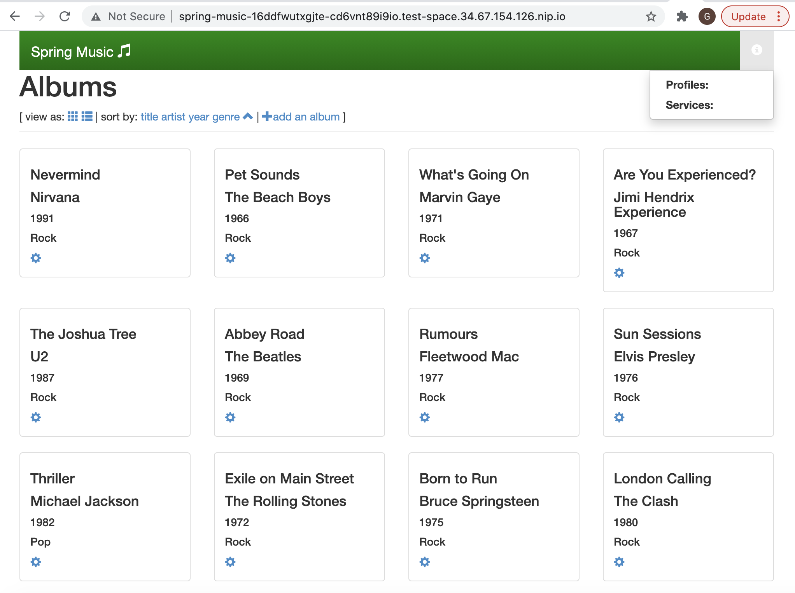
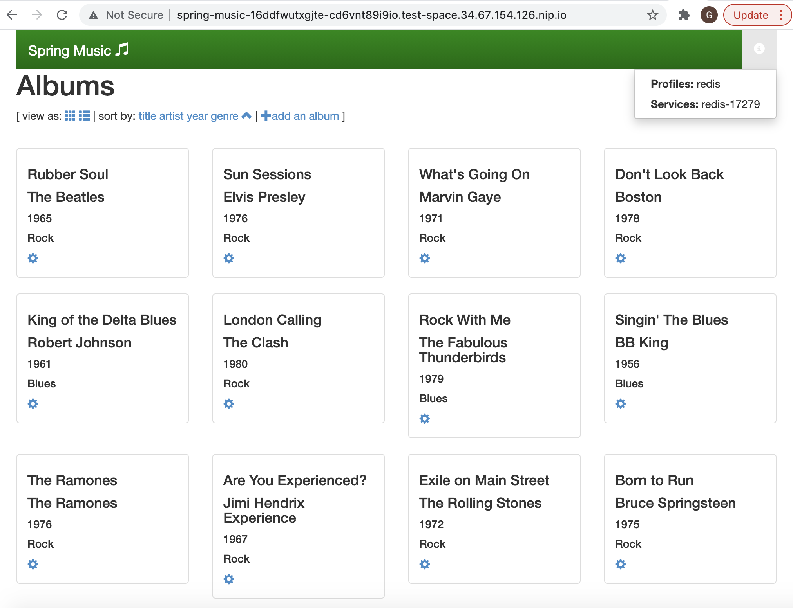

# Accessing Redis Enterprise Database from Google Cloud Platform's Kf environment through user provided service

## High Level Workflow
The following is the high level workflow which you will follow:
1. Clone this repo
2. Create a GKE cluster for Kf
3. Install Anthos Service Mesh (ASM)
4. Install Tekton (CI/CD)
5. Install Kf client on our machine
6. Install Kf on the GKE cluster
7. Create a namespace for this deployment and deploy the Redis Enterprise Operator bundle
8. Deploy a Redis Enterprise Cluster (REC)
9. Deploy Ingress Gateway and Create routes for Redis Enterprise Cluster's HTTPS web access
10. Access Redis Enterprise Cluster's console
11. Create a Redis Enterprise database instance without SSL/TLS enabled
12. Create user provided service (vcups) in Kf
13. Update Ingress Gateway to include Redis Enterprise Database instance
14. Add a custom port for Redis Enterprise database connection to default ingress gateway
15. Deploy Spring Music application to Kf
16. Verify Spring Music app's data is being stored on the Redis Enterprise database


#### 1. Clone this repo
```
git clone https://github.com/Redislabs-Solution-Architects/redis-enterprise-cloud-gcp
cd kf/access-via-vcups
```

#### 2. Create a GKE cluster for Kf
Setup environment variables:
```
export PROJECT_ID=$(gcloud info --format='value(config.project)')
export CLUSTER_PROJECT_ID=$(gcloud info --format='value(config.project)')
export CLUSTER_NAME=glau-kf-gke-cluster
export COMPUTE_ZONE=us-central1-a
export COMPUTE_REGION=us-central1
export CLUSTER_LOCATION=${COMPUTE_ZONE}
export NODE_COUNT=5
export MACHINE_TYPE=e2-standard-8
export NETWORK=default
export KF_VERSION=v2.3.2
export TEKTON_VERSION=v0.19.0
```  
  
**Service account setup:**  
Create the service account that Kf will use:
```
gcloud iam service-accounts create ${CLUSTER_NAME}-sa \
  --project=${CLUSTER_PROJECT_ID} \
  --description="GSA for Kf ${CLUSTER_NAME}" \
  --display-name="${CLUSTER_NAME}"
```
  
Create the service account that Kf will use:
Allow the service account to modify its own policy. The Kf controller will use this to add new (name)spaces to the policy, allowing reuse for Workload Identity:
```
gcloud iam service-accounts add-iam-policy-binding ${CLUSTER_NAME}-sa@${CLUSTER_PROJECT_ID}.iam.gserviceaccount.com \
  --project=${CLUSTER_PROJECT_ID} \
  --role="roles/iam.serviceAccountAdmin" \
  --member="serviceAccount:${CLUSTER_NAME}-sa@${CLUSTER_PROJECT_ID}.iam.gserviceaccount.com"
```
  
Give monitoring metrics role for write access to Cloud Monitoring:
```
gcloud projects add-iam-policy-binding ${CLUSTER_PROJECT_ID} \
  --member="serviceAccount:${CLUSTER_NAME}-sa@${CLUSTER_PROJECT_ID}.iam.gserviceaccount.com" \
  --role="roles/monitoring.metricWriter"
```
  
Give logging role for write access to Cloud Logging:
```
gcloud projects add-iam-policy-binding ${CLUSTER_PROJECT_ID} \
  --member="serviceAccount:${CLUSTER_NAME}-sa@${CLUSTER_PROJECT_ID}.iam.gserviceaccount.com" \
  --role="roles/logging.logWriter"
```
  
Create GKE cluster:  
```
gcloud container clusters create ${CLUSTER_NAME} \
  --project=${CLUSTER_PROJECT_ID} \
  --zone=${CLUSTER_LOCATION} \
  --num-nodes=${NODE_COUNT} \
  --machine-type=${MACHINE_TYPE} \
  --network=${NETWORK} \
  --addons=HttpLoadBalancing,HorizontalPodAutoscaling,NetworkPolicy \
  --enable-stackdriver-kubernetes \
  --enable-ip-alias \
  --enable-network-policy \
  --enable-autorepair \
  --enable-autoupgrade \
  --scopes=https://www.googleapis.com/auth/cloud-platform \
  --release-channel=regular \
  --workload-pool="${CLUSTER_PROJECT_ID}.svc.id.goog" \
  --service-account="${CLUSTER_NAME}-sa@${CLUSTER_PROJECT_ID}.iam.gserviceaccount.com"
```

Enable workload idenity:
```
gcloud iam service-accounts add-iam-policy-binding \
  "${CLUSTER_NAME}-sa@${CLUSTER_PROJECT_ID}.iam.gserviceaccount.com" \
  --project=${CLUSTER_PROJECT_ID} \
  --role="roles/iam.workloadIdentityUser" \
  --member="serviceAccount:${CLUSTER_PROJECT_ID}.svc.id.goog[kf/controller]"
```

Target GKE cluster:
```
gcloud container clusters get-credentials ${CLUSTER_NAME} \
    --project=${CLUSTER_PROJECT_ID} \
    --zone=${CLUSTER_LOCATION}
```
  
**Create an Artifact Registry repository:**  
Create an Artifact Registry for container images to be stored:
```
gcloud artifacts repositories create ${CLUSTER_NAME} \
  --project=${CLUSTER_PROJECT_ID} \
  --repository-format=docker \
  --location=${COMPUTE_REGION}
```  
Grant the service account permission on the Artifact Registry repository: 
```
gcloud artifacts repositories add-iam-policy-binding ${CLUSTER_NAME} \
  --project=${CLUSTER_PROJECT_ID} \
  --location=${COMPUTE_REGION} \
  --member="serviceAccount:${CLUSTER_NAME}-sa@${CLUSTER_PROJECT_ID}.iam.gserviceaccount.com" \
  --role='roles/artifactregistry.writer'
```


#### 3. Install Anthos Service Mesh (ASM)
Download ASM installation script
```
curl https://storage.googleapis.com/csm-artifacts/asm/install_asm_1.9 > install_asm
curl https://storage.googleapis.com/csm-artifacts/asm/install_asm_1.9.sha256 > install_asm.sha256
sha256sum -c --ignore-missing install_asm.sha256
chmod +x install_asm
```
Install Anthos Service Mesh (ASM)
Please make sure you have all the required [GCP IAM permissions](https://cloud.google.com/service-mesh/docs/installation-permissions) before running the script below.
```
./install_asm \
  --project_id $PROJECT_ID \
  --cluster_name $CLUSTER_NAME  \
  --cluster_location $CLUSTER_LOCATION  \
  --mode install \
  --output_dir ./asm-downloads \
  --enable_all
```


#### 4. Install Tekton (CI/CD):
```
kubectl apply -f "https://github.com/tektoncd/pipeline/releases/download/${TEKTON_VERSION}/release.yaml"
```  


#### 5. Install Kf client on our machine:
```
Linux version:
gsutil cp gs://kf-releases/${KF_VERSION}/kf-linux /tmp/kf
chmod a+x /tmp/kf
sudo mv /tmp/kf /usr/local/bin/kf

Mac version:
gsutil cp gs://kf-releases/${KF_VERSION}/kf-darwin /tmp/kf
chmod a+x /tmp/kf
sudo mv /tmp/kf /usr/local/bin/kf
```


#### 6. Install Kf on the GKE cluster:
```
gsutil cp gs://kf-releases/${KF_VERSION}/kf.yaml /tmp/kf.yaml
kubectl apply -f /tmp/kf.yaml
```
```
export WI_ANNOTATION=iam.gke.io/gcp-service-account=${CLUSTER_NAME}-sa@${CLUSTER_PROJECT_ID}.iam.gserviceaccount.com

kubectl annotate serviceaccount controller ${WI_ANNOTATION} \
--namespace kf \
--overwrite

echo "{\"apiVersion\":\"v1\",\"kind\":\"ConfigMap\",\"metadata\":{\"name\":\"config-secrets\", \"namespace\":\"kf\"},\"data\":{\"wi.googleServiceAccount\":\"${CLUSTER_NAME}-sa@${CLUSTER_PROJECT_ID}.iam.gserviceaccount.com\"}}" | kubectl apply -f -
```
```
export CONTAINER_REGISTRY=${COMPUTE_REGION}-docker.pkg.dev/${CLUSTER_PROJECT_ID}/${CLUSTER_NAME}
export DOMAIN='$(SPACE_NAME).$(CLUSTER_INGRESS_IP).nip.io'

kubectl patch configmaps config-defaults \
-n=kf \
-p="{\"data\":{\"spaceContainerRegistry\":\"${CONTAINER_REGISTRY}\",\"spaceClusterDomains\":\"- domain: ${DOMAIN}\"}}"
```

Verfiy Kf setup:
```
kf doctor --retries 10
```  
You should see the following output if Kf was successfully installed:  
```
=== RUN	doctor/istio
=== RUN	doctor/istio/Injection
=== RUN	doctor/istio/Injection/Namespace
--- PASS: doctor/istio
    --- PASS: doctor/istio/Injection
        --- PASS: doctor/istio/Injection/Namespace
=== RUN	doctor/user
=== RUN	doctor/user/ContainerRegistry
--- PASS: doctor/user
    --- PASS: doctor/user/ContainerRegistry
PASS
```

#### 7. Create a namespace for this deployment and deploy the Redis Enterprise Operator bundle
```
kubectl create namespace redis
kubectl config set-context --current --namespace=redis

kubectl apply -f https://raw.githubusercontent.com/RedisLabs/redis-enterprise-k8s-docs/v6.0.20-12/bundle.yaml
```


#### 8. Deploy a Redis Enterprise Cluster (REC)
```
kubectl apply -f - <<EOF
apiVersion: app.redislabs.com/v1alpha1
kind: RedisEnterpriseCluster
namespace: redis
metadata:
  name: rec
spec:
  nodes: 3
EOF
```
  
#### 9. Deploy Ingress Gateway and Create routes for Redis Enterprise Cluster's HTTPS web access
Define gateway for HTTPS access:
```
export INGRESS_HOST=$(kubectl -n istio-system get service istio-ingressgateway \
       -o jsonpath='{.status.loadBalancer.ingress[0].ip}')
export SECURE_INGRESS_PORT=$(kubectl -n istio-system get service istio-ingressgateway \
       -o jsonpath='{.spec.ports[?(@.name=="https")].port}')

kubectl apply -f - <<EOF
apiVersion: networking.istio.io/v1alpha3
kind: Gateway
metadata:
  name: redis-gateway
spec:
  selector:
    istio: ingressgateway # use istio default ingress gateway
  servers:
  - port:
      number: ${SECURE_INGRESS_PORT}
      name: https
      protocol: HTTPS
    tls:
      mode: PASSTHROUGH
    hosts:
    - rec-ui.${INGRESS_HOST}.nip.io
EOF
```
Configure routes for traffic entering via the gateway:
```
kubectl apply -f - <<EOF
apiVersion: networking.istio.io/v1alpha3
kind: VirtualService
metadata:
  name: rec
spec:
  hosts:
  - rec-ui.${INGRESS_HOST}.nip.io
  gateways:
  - redis-gateway
  tls:
  - match:
    - port: ${SECURE_INGRESS_PORT}
      sniHosts:
      - rec-ui.${INGRESS_HOST}.nip.io
    route:
    - destination:
        host: rec-ui
        port:
          number: 8443
EOF
```
    
#### 10. Access Redis Enterprise Cluster's console
Grab the password for demo@redislabs.com user for accessing REC's configuration manager (CM):
```
kubectl get secrets -n redis rec -o jsonpath="{.data.password}" | base64 --decode
```
Access the CM's login page using the following URL:
```
https://rec-ui.<$INGRESS_HOST>.nip.io:443

For example:
https://rec-ui.34.83.116.191.nip.io:443
```
Log in using demo@redislabs.com and the password collected above to view the cluster information in CM.

  
#### 11. Create a Redis Enterprise database instance without SSL/TLS enabled
Deploy a Redis Enterprise database:
```
kubectl apply -f - <<EOF
apiVersion: app.redislabs.com/v1alpha1
kind: RedisEnterpriseDatabase
namespace: redis
metadata:
  name: redis-enterprise-database
spec:
  memorySize: 100MB
EOF
```
  
#### 12. Create user provided service (vcups) in Kf
```
export INGRESS_HOST=$(kubectl -n istio-system \
   get service istio-ingressgateway \
   -o jsonpath='{.status.loadBalancer.ingress[0].ip}')

export DB_PORT=$(kubectl get secrets -n redis \
   redb-redis-enterprise-database \
   -o jsonpath="{.data.port}" | base64 --decode)

export DB_PASSWORD=$(kubectl get secrets -n redis \
   redb-redis-enterprise-database \
   -o jsonpath="{.data.password}" | base64 --decode)

kf create-space test-space

kf target -s test-space

kf cups redis-${DB_PORT} -p \
'{"uri":"redis://:'${DB_PASSWORD}'@redis-'${DB_PORT}'.demo.rec.'${INGRESS_HOST}'.nip.io:'${DB_PORT}'"}' -t "redis"
```  
Confirm service instance creation:
```
kf services
```  
  
#### 13. Update Ingress Gateway to include Redis Enterprise Database instance
Define gateway for TCP access:
```
kubectl apply -f - <<EOF
apiVersion: networking.istio.io/v1alpha3
kind: Gateway
metadata:
  name: redis-gateway
spec:
  selector:
    istio: ingressgateway # use istio default ingress gateway
  servers:
  - port:
      number: ${SECURE_INGRESS_PORT}
      name: https
      protocol: HTTPS
    tls:
      mode: PASSTHROUGH
    hosts:
    - rec-ui.${INGRESS_HOST}.nip.io
  - port:
      number: ${DB_PORT}
      name: redis-${DB_PORT}
      protocol: TCP
    hosts:
    - redis-${DB_PORT}.demo.rec.${INGRESS_HOST}.nip.io
EOF
```    
Configure routes for traffic entering via the gateway for the database:  
```
kubectl apply -f - <<EOF
apiVersion: networking.istio.io/v1alpha3
kind: VirtualService
metadata:
  name: redis-bdbs
spec:
  hosts:
  - "*.demo.rec.${INGRESS_HOST}.nip.io"
  gateways:
  - redis-gateway
  tcp:
  - match:
    - port: ${DB_PORT}
    route:
    - destination:
        host: redis-enterprise-database
        port:
          number: ${DB_PORT}
EOF
```  
  
#### 14. Add a custom port for Redis Enterprise database connection to default ingress gateway
```
kubectl edit svc istio-ingressgateway -n istio-system
```
Add the following next to other port definitions:
```
- name: redis-port
  nodePort: <node-port-of-your-choice>
  port: <replace with ${DB_PORT}>
  protocol: TCP
  targetPort: <replace with ${DB_PORT}>

For example,
- name: redis-port
  nodePort: 31402
  port: 13813
  protocol: TCP
  targetPort: 13813
```
  

#### 15. Deploy Spring Music application to Kf
```
git clone https://github.com/cloudfoundry-samples/spring-music.git spring-music
cd spring-music
```
Edit manifest.yaml as follows:
```
---
applications:
- name: spring-music
  memory: 1G
  random-route: true
  stack: org.cloudfoundry.stacks.cflinuxfs3
  env:
    BP_AUTO_RECONFIGURATION_ENABLED: false
```  
Push the Spring Music for deployment:
```
kf push spring-music
```
Access the Spring Music app using the access URL:
```
kf apps
```  
The access URL should look like the following:
```
Ex. spring-music-16ddfwutxgjte-cd6vnt89i9io.test-space.34.67.154.126.nip.io
```  
You should see both Profiles: and Services: are empty as follows:  
  

Bind the user provided service instance for the Redis Enterprise database to the Spring Music app:
```
kf bind-service spring-music redis-${DB_PORT}
kf restart spring-music
```
Access the Spring Music app again and you should see **Proflies:redis & Services:redis-<db-port-number>** as follows:
  

  
  

#### 16. Verify Spring Music app's data is being stored on the Redis Enterprise database
```
kf vcap-services spring-music
```
Find the default user's password of the Redis Enterprise database instance:
```
kubectl get secrets -n redis redb-redis-enterprise-database \
-o jsonpath="{.data.password}" | base64 --decode
```
Connect to the database:
```
redis-cli -h ${DB_PORT}.demo.rec.${INGRESS_HOST}.nip.io -p ${DB_PORT}
```
Authenticate into the database:
```
> auth <Redis Enterprise database instance's default user's password>
```
Verify the **album** key in the database:
```
> keys *
```
Find out the data type for **albums":
```
> type albums
```
Retrieve the value of the **albums** key:
```
> hgetall albums
```


